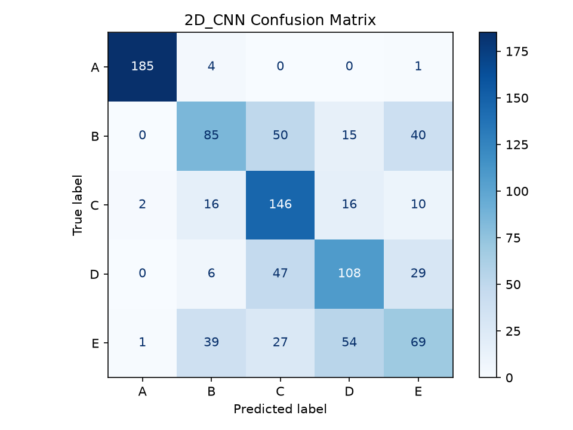
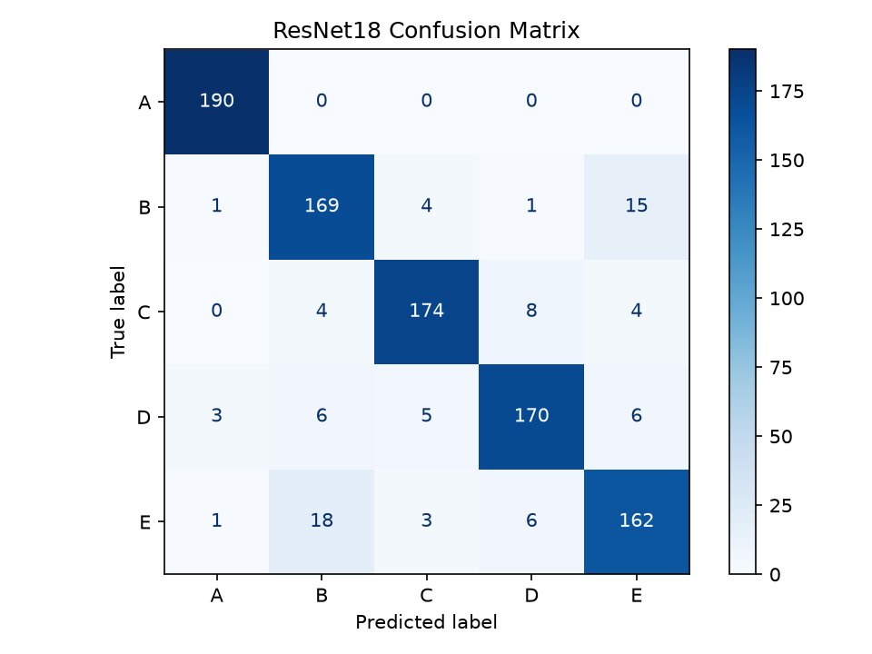

# AI 모델 재현 및 성능 비교 과제

손바닥 sEMG 신호로 등록된 사용자 A–E를 분류하는 5클래스 식별 실험이다. 아래 표와 그림은 모두 `results/submission/`의 현재 측정값을 사용한다.

## 1. 코드 설명

### 데이터 및 전처리

A–E 5명 × 50시행, 총 250 CSV를 사용한다. 각 시행은 1,000 Hz, 3초, 3,000샘플 × 2채널(APB·ADM)이다. 데이터는 [논문 저자 공개 저장소](https://github.com/sea3551/palm-sEMG-doorknob-filtered)에서 제공하며, © 2025 Yeonjung Shin, CC BY 4.0이다. 라이선스 전문은 [DATA_LICENSE.txt](DATA_LICENSE.txt)에 보존했다.

1. 시행 파일을 사용자별 비율을 유지하도록 계층화하여 학습 80% / 테스트 20%로 먼저 분할한다. 현재 공통 시드는 **37**이다.
2. 각 집합 안에서 300샘플 윈도우를 150샘플 간격으로 생성한다. 50% overlap이며 시행당 19윈도우가 나온다.
3. 각 윈도우의 시간·두 채널 축을 함께 사용하여 min–max 정규화한다.
4. Morlet(`morl`) CWT를 scales 1–32로 적용하고 절댓값을 취한다. 두 채널의 CWT와 그 평균을 쌓아 `(3, 32, 300)` 입력을 만든다.

정규화 식은 `(x - min) / (max - min + 1e-8)`이다. `eps=1e-8`은 같은 값으로 채워진 윈도우에서 0으로 나누는 것을 방지하는 값이며, 정규화 범위는 0~1이다. 분모에 eps를 더하므로 최댓값은 엄밀하게는 1보다 조금 작다.

공개 CSV에는 이미 60 Hz notch와 20–500 Hz band-pass 필터링이 적용되어 기본 실행에서 재필터링하지 않는다. `--raw-data`는 별도로 확보한 미필터링 신호에만 사용한다.


| 집합 | A | B | C | D | E | 시행 수 | 윈도우 수 |
| --- | --- | --- | --- | --- | --- | --- | --- |
| Train | 40 | 40 | 40 | 40 | 40 | 200 | 3800 |
| Test | 10 | 10 | 10 | 10 | 10 | 50 | 950 |

같은 시행에서 나온 겹치는 윈도우가 학습·테스트에 섞이지 않도록 파일 단위로 먼저 분할한다. 테스트 950윈도우는 서로 독립인 950시행이 아니라 50시행에서 생성된 조각이다.

### 모델과 공통 학습 설정

2주차 DenseNet161 실습과 3주차 2D CNN·ResNet18 실습을 기준으로 구현했다. 논문은 Dropout 적용을 명시하지만 세부 비율은 확인되지 않아 기존 값 0.5를 세 모델의 분류기 앞에 공통 적용했다.


| 설정 | 세 모델 공통값 |
| --- | --- |
| Seed | 37 |
| Epochs | 45 |
| Batch size | 16 |
| Optimizer | Adam |
| Learning rate | 0.001 |
| Adam betas / eps / weight decay | (0.9, 0.999) / 1e-8 / 0 |
| Loss | CrossEntropyLoss |
| 분류기 Dropout | 0.5 |
| 사전학습 | 미사용 |
| 정밀도 | FP32, AMP·TF32 미사용 |
| Scheduler / 조기종료 | 미사용 |
| 최종 평가 | 마지막 45번째 epoch |
| 중간 테스트 | 매 epoch 콘솔 출력 |

| 모델 | 구조 | 학습 파라미터 수 |
| --- | --- | --- |
| 2D_CNN | Conv 3→32 / ReLU / MaxPool / Conv 32→64 / ReLU / Global Average Pool / Dropout / FC 64→5 | 19,717 |
| ResNet18 | Torchvision 기본 잔차 구조, 분류기 Dropout / FC 512→5 | 11,179,077 |
| DenseNet161 | blocks [6,12,36,24], growth rate 48, 분류기 Dropout / FC 2208→5 | 26,483,045 |

세 모델은 같은 데이터·분할·전처리와 학습 설정을 사용한다. 모델마다 시드와 학습 DataLoader generator를 다시 설정한다. 구조 자체가 다르므로 파라미터 수와 계산 비용은 다르다. 상세 설정은 [PARAMETERS.md](PARAMETERS.md)를 참고한다.

매 epoch의 Train/Test loss·accuracy를 콘솔에 출력한다. 테스트에서는 `model.eval()`·`torch.no_grad()`를 사용하고 다음 epoch에서 `model.train()`으로 돌아간다. 테스트 최고 epoch를 선택하거나 테스트로 역전파하지 않고 마지막 epoch를 최종 평가한다.

### 실행 방법

현재 프로젝트의 실행 환경은 Python 3.14.7, PyTorch 2.14.0+cu130, Torchvision 0.29.0+cu130이다. 기존 가상환경에서는 프로젝트 루트에서 실행한다.

```powershell
$env:PYTHONUTF8 = "1"
.\.venv\Scripts\python.exe -u code/main.py

# 기본 8:2 비교 + DenseNet161 5-fold 교차검증
.\.venv\Scripts\python.exe -u code/main.py --cv

# 세 모델 모두 5-fold 교차검증
.\.venv\Scripts\python.exe -u code/main.py --cv --cv-models 2D_CNN ResNet18 DenseNet161
```

새 환경이 필요하다면 Python 3.14에서 별도 가상환경을 만들고 [requirements.txt](requirements.txt)로 설치한다.

```powershell
py -3.14 -m venv .venv-repro
.\.venv-repro\Scripts\python.exe -m pip install -r requirements.txt
.\.venv-repro\Scripts\python.exe -u code/main.py
```

GPU 사용 가능 여부에 따라 CUDA 또는 CPU를 선택한다. 장비와 라이브러리 버전이 다르면 동일 시드에서도 결과 차이가 날 수 있다.

기본 출력은 `results/submission/`이다. 이미 파일이 있으면 시간표시를 붙인 새 결과 폴더를 사용한다. 저장 파일은 모델별 혼동행렬 PNG/CSV 6개, 성능 비교 CSV, 혼동행렬 분석 CSV이며, CV 실행 시 폴드 결과 CSV 1개를 추가한다. epoch별 파일·가중치·예측 목록·로그·학습곡선은 내보내지 않는다. README는 직접 작성하며 실행 중 자동 생성·수정하지 않는다.

### 파일 역할


| 파일 | 역할 |
| --- | --- |
| code/main.py | 공통 조건으로 세 모델 실행 및 선택적 교차검증 |
| code/settings.py | 공통 학습 설정 |
| code/data.py | CSV 검증·분할·윈도우·정규화·CWT |
| code/models.py | 강의 기반 모델 구성 |
| code/train.py | 학습 및 매 epoch 테스트 출력 |
| code/evaluation.py | 성능 지표·혼동행렬·오분류 분석 |

## 2. 모델 성능 비교

Accuracy는 전체 정답 비율이고, Precision·Recall·F1은 A–E 클래스의 **macro 평균**이다. 마지막 45번째 epoch 모델을 고정 테스트 950윈도우에서 평가했다.


| Model | Accuracy | Precision | Recall | F1-score |
| --- | --- | --- | --- | --- |
| 2D_CNN | 62.42% | 62.28% | 62.42% | 61.69% |
| ResNet18 | 91.05% | 91.06% | 91.05% | 91.04% |
| DenseNet161 | 91.58% | 91.70% | 91.58% | 91.58% |

### 성능 분석

**DenseNet161이 Accuracy 91.58%, macro F1 91.58%로 가장 높았다.** ResNet18은 Accuracy 91.05%, macro F1 91.04%로 근접했고, 간단한 2D CNN은 Accuracy 62.42%, macro F1 61.69%로 가장 낮았다.

DenseNet과 ResNet의 Accuracy 차이는 0.53%p로 테스트 950윈도우 중 정답 5개 차이다. 단일 분할의 작은 차이만으로 통계적 우위를 주장하지 않는다. 깊은 모델의 특징 재사용과 잔차 연결이 분류에 유리했을 가능성이 있지만, 원인을 확정하려면 구조별 통제 실험이 필요하다.

### 5-fold 교차검증

학습용 200시행을 사용자별 비율을 유지하여 5개 fold로 나눈다(`StratifiedKFold`, shuffle=True, seed=37). 매 fold에서 새 모델을 학습 160시행 / 검증 40시행으로 45 epoch 학습한다. 검증은 760윈도우이며, 독립 테스트 50시행은 CV에 포함하지 않는다.

아래 표는 현재 `cross_validation.csv`의 측정값이다. 값은 Accuracy / macro F1 순서다.


| Model | Fold 1 | Fold 2 | Fold 3 | Fold 4 | Fold 5 |
| --- | --- | --- | --- | --- | --- |
| 2D_CNN | 65.00% / 64.42% | 61.71% / 61.42% | 60.39% / 59.84% | 61.18% / 59.22% | 62.11% / 61.15% |
| ResNet18 | 86.71% / 86.63% | 86.05% / 86.02% | 85.66% / 85.58% | 86.97% / 86.80% | 84.74% / 84.50% |
| DenseNet161 | 86.58% / 86.72% | 85.00% / 84.98% | 86.84% / 87.02% | 74.87% / 73.52% | 80.79% / 80.44% |

| Model | CV Accuracy 평균 ± 표준편차 | CV F1 평균 ± 표준편차 |
| --- | --- | --- |
| 2D_CNN | 62.08% ± 1.57% | 61.21% ± 1.80% |
| ResNet18 | 86.03% ± 0.80% | 85.91% ± 0.83% |
| DenseNet161 | 82.82% ± 4.53% | 82.54% ± 5.08% |

표준편차는 5개 fold 결과의 모집단 표준편차(`ddof=0`)로 계산했다.

**교차검증에서는 ResNet18이 평균 성능과 안정성에서 더 좋은 결과를 보였다.** DenseNet161은 Fold 4 Accuracy가 74.87%까지 떨어져, 고정 테스트에서 가장 높은 점수를 얻었더라도 모든 분할에서 가장 우수한 것은 아니었다. 구체적인 하락 원인은 이 요약값만으로 확정할 수 없다.

CV는 기본 테스트 모델을 교체하거나 앙상블하지 않는다. 최고 fold 모델을 선택해 독립 테스트에 평가하는 논문의 추가 절차와도 구분한다.

### 계산 비용


| Model | Parameters | 학습 시간(s) | 추론(ms/윈도우) |
| --- | --- | --- | --- |
| 2D_CNN | 19,717 | 36.86 | 0.202 |
| ResNet18 | 11,179,077 | 225.09 | 2.655 |
| DenseNet161 | 26,483,045 | 1073.93 | 31.038 |

학습 시간은 기본 8:2 학습 루프와 중간 테스트·출력을 포함하며 CWT 전처리·최종 평가는 제외한다. CV 5회 학습 시간의 합은 아니다. 추론 시간은 장치 메모리에 있는 batch 1 입력을 10회 예열한 뒤 100회 평균한 모델 forward 시간으로, 신호 취득·CWT·전송은 제외한다. GPU 측정 시 CUDA 동기화를 사용한다.

DenseNet은 ResNet보다 학습과 추론 비용이 크다. 고정 테스트 점수뿐 아니라 교차검증 안정성과 처리 시간을 함께 고려하면 ResNet18도 유력한 선택이다.

## 3. Confusion Matrix 분석

행은 실제 클래스, 열은 예측 클래스다. 클래스별 표본 수는 190윈도우다. 가장 잘/못 분류된 클래스는 행별 Recall로, 주요 오분류는 비대각 원소 개수로 판단한다.


### 2D_CNN



- 가장 잘 분류된 클래스: **A**, Recall 97.37%
- 가장 많이 오분류된 클래스: **E**, Recall 36.32%
- 주요 오분류 유형: **E → D**, 각각 54개


| 실제 / 예측 | A | B | C | D | E |
| --- | --- | --- | --- | --- | --- |
| A | 185 | 4 | 0 | 0 | 1 |
| B | 0 | 85 | 50 | 15 | 40 |
| C | 2 | 16 | 146 | 16 | 10 |
| D | 0 | 6 | 47 | 108 | 29 |
| E | 1 | 39 | 27 | 54 | 69 |

B→C 50개, D→C 47개도 발생했다. A는 잘 구분하지만 B·D·E를 구분하는 데 어려움이 보인다. 얕은 모델과 전역 평균 풀링의 표현력 한계가 가능한 설명이다. 이 모델은 강의 예시의 19,717파라미터 CNN으로, 논문의 4,944,901파라미터 CNN과 동일하지 않다.

오류 원인에 대한 위 설명은 가설이며, 시행 간 신호 변화나 과적합의 기여도를 확인하려면 추가 분석이 필요하다.

### ResNet18



- 가장 잘 분류된 클래스: **A**, Recall 100.00%
- 가장 많이 오분류된 클래스: **E**, Recall 85.26%
- 주요 오분류 유형: **E → B**, 각각 18개


| 실제 / 예측 | A | B | C | D | E |
| --- | --- | --- | --- | --- | --- |
| A | 190 | 0 | 0 | 0 | 0 |
| B | 1 | 169 | 4 | 1 | 15 |
| C | 0 | 4 | 174 | 8 | 4 |
| D | 3 | 6 | 5 | 170 | 6 |
| E | 1 | 18 | 3 | 6 | 162 |

A의 190윈도우는 모두 맞혔다. E→B 18개와 B→E 15개로 B·E 사이 혼동이 주요 오류다. 두 사용자의 특징이 이 모델의 표현 공간에서 겹쳤을 가능성이 있으나, 혼동행렬만으로 근육 활성의 생리학적 원인을 확정할 수는 없다.

오류 원인에 대한 위 설명은 가설이며, 시행 간 신호 변화나 과적합의 기여도를 확인하려면 추가 분석이 필요하다.

### DenseNet161


- 가장 잘 분류된 클래스: **A**, Recall 99.47%
- 가장 많이 오분류된 클래스: **E**, Recall 84.21%
- 주요 오분류 유형: **E → B, E → D**, 각각 13개


| 실제 / 예측 | A | B | C | D | E |
| --- | --- | --- | --- | --- | --- |
| A | 189 | 0 | 0 | 1 | 0 |
| B | 0 | 173 | 4 | 5 | 8 |
| C | 0 | 2 | 176 | 10 | 2 |
| D | 0 | 6 | 10 | 172 | 2 |
| E | 0 | 13 | 4 | 13 | 160 |

A는 190개 중 189개를 맞혔다. E→B와 E→D가 각각 13개로 가장 많았고, C→D와 D→C도 각각 10개였다. 전체 점수는 높지만 E의 Recall은 ResNet보다 낮아 모든 클래스에서 우수한 것은 아니다.

오류 원인에 대한 위 설명은 가설이며, 시행 간 신호 변화나 과적합의 기여도를 확인하려면 추가 분석이 필요하다.

## 4. 최종 결과

- 고정 테스트에서 가장 성능이 좋은 모델: **DenseNet161**, Accuracy / macro F1 모두 91.58%
- 고정 테스트에서 가장 성능이 낮은 모델: **2D_CNN**, Accuracy 62.42%, macro F1 61.69%
- 교차검증 평균 성능과 안정성이 가장 좋은 모델: **ResNet18**
- 주요 오분류: 2D CNN의 E→D, ResNet의 E→B, DenseNet의 E→B·D

이번 실험에서는 DenseNet161과 ResNet18이 간단한 CNN보다 높은 성능을 보였다. DenseNet이 고정 테스트에서 가장 높았지만 ResNet은 CV 평균과 변동, 처리 시간에서 유리했다. 따라서 한 번의 정확도만으로 모델을 판단하기보다 클래스별 오류·분할에 따른 안정성·계산 비용을 함께 확인해야 한다는 점을 배웠다.

### 논문과의 비교

[참고 논문](https://www.nature.com/articles/s41598-026-46294-3)은 ResNet18 Accuracy 88.11%, DenseNet161 94.00%를 보고한다. 현재 결과는 각각 91.05%(+2.94%p), 91.58%(−2.42%p)다. 정확한 시행 분할·시드, 첫 합성곱 수정과 Dropout 세부 구현 등이 완전히 일치하는지는 확인되지 않았다. 이번 구현은 제공된 강의 실습 코드를 기준으로 하며, 논문 전체의 완전한 재현이라고 주장하지 않는다.

논문은 DenseNet 5-fold 평균 Accuracy 91.66 ± 2.78%와 최고 fold 모델의 독립 테스트 Accuracy 93.37%를 별도로 보고한다. 현재 CV는 fold별 마지막 epoch의 성능을 요약하며 최고 fold 모델로 기본 테스트 결과를 교체하지 않는다.

### 해석의 한계

여러 시드의 테스트 결과를 비교한 뒤 현재 설정(seed 37)을 보고 대상으로 선택했다. 마지막 epoch는 고정했지만, 이 결과를 테스트와 무관하게 사전 확정한 설정의 독립 평가라고 해석해서는 안 된다. 추후 설정의 우수성을 검증하려면 검증 데이터로 설정을 정한 뒤 새로운 독립 데이터에서 평가해야 한다.

또한 5명·한정된 측정 조건의 closed-set 식별 실험이다. 미등록자 거절, 날짜 변화, 전극 재부착 등에 대한 인증 성능은 검증하지 않았다. 같은 시행의 윈도우는 서로 겹치므로 950개를 독립 측정 횟수로 간주한 통계적 주장을 하지 않는다.

현재 설정·환경은 프로젝트 코드와 가상환경에서 확인했지만, 결과 CSV 자체에는 실행 당시의 전체 환경·설정 기록이 없다. 이를 소급하여 완전히 증명할 수 없다는 제한도 있다.

### 결과 파일 및 제출

- [모델 성능 비교](results/submission/model_comparison.csv)
- [오분류 요약](results/submission/confusion_analysis.csv)
- [5-fold 결과](results/submission/cross_validation.csv)
- 모델별 혼동행렬 PNG/CSV: `results/submission/`

제출 주소: **https://github.com/Juhyun1123/sEMG-Based_Authentication_Project**

